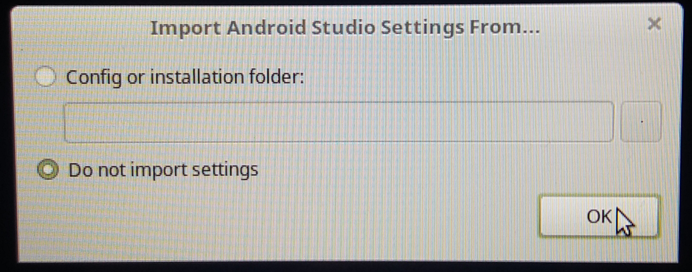
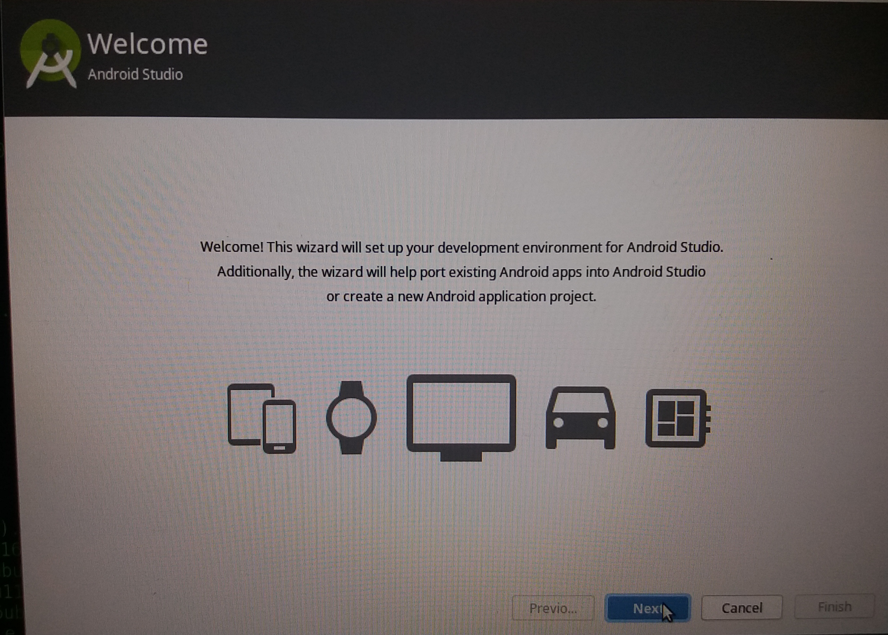
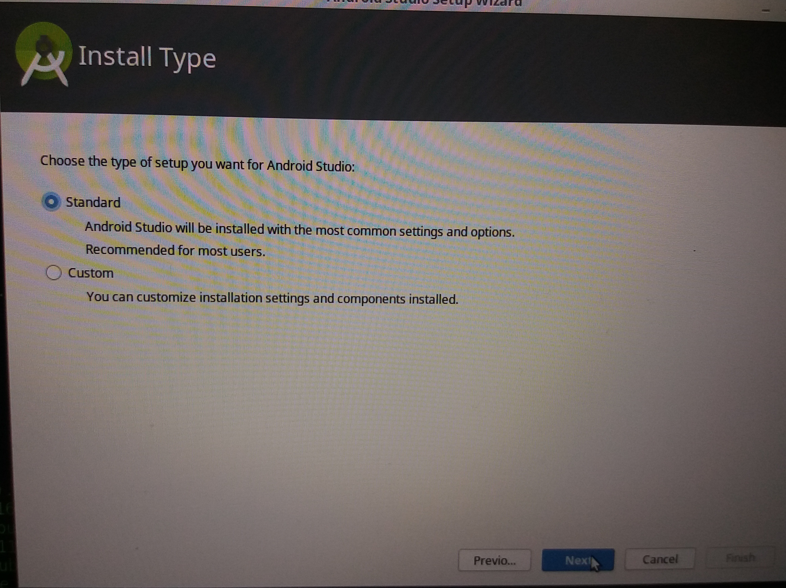
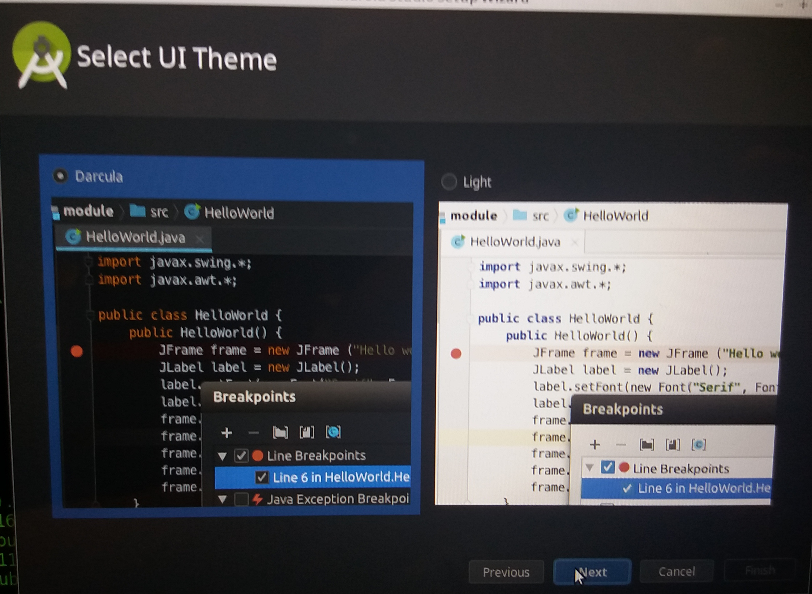
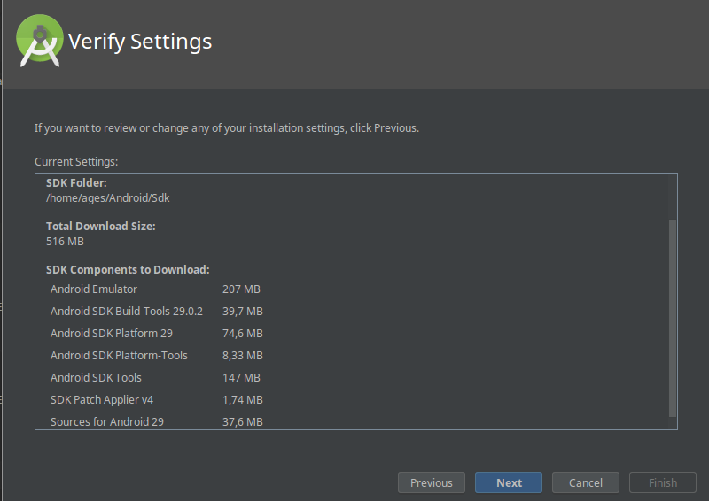
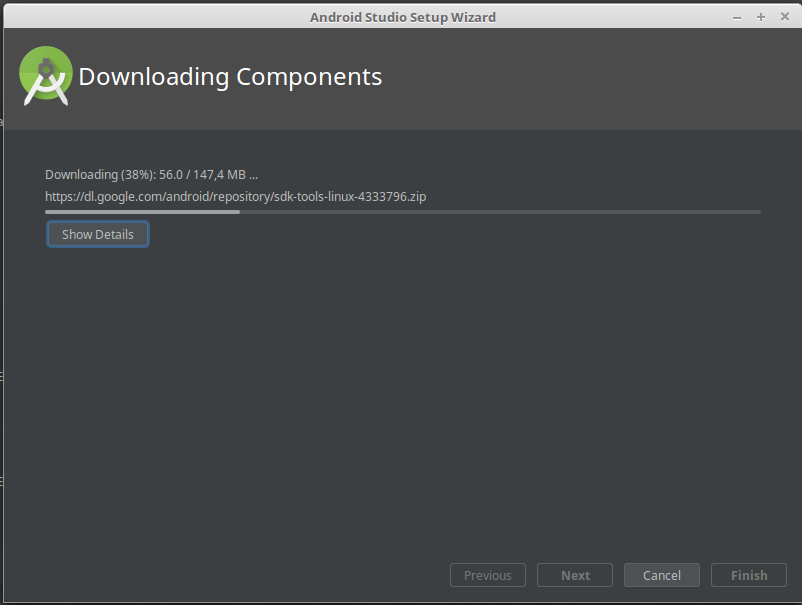
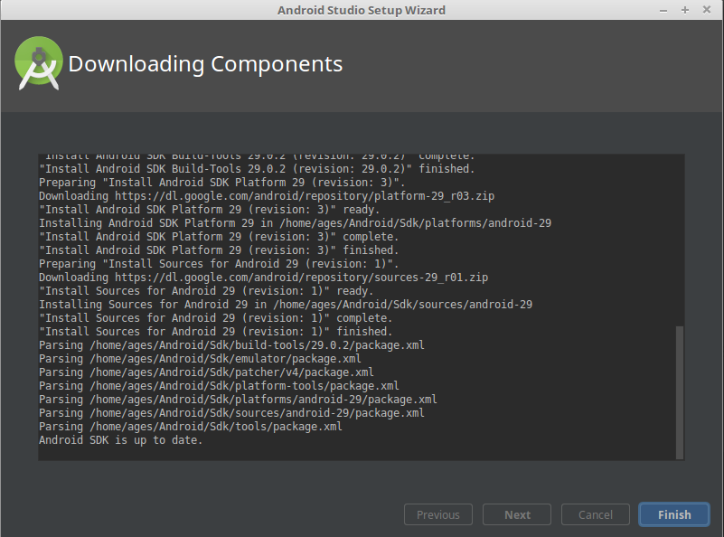
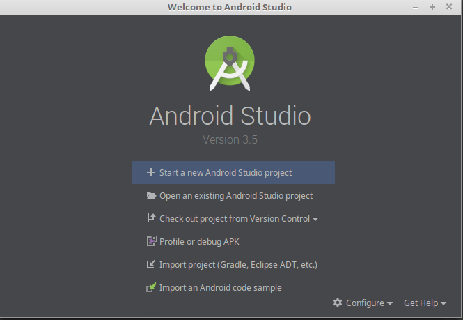

# DIRETORIO DE INFORMACOES SOBRE O ANDROID STUDIO

## Arquivos

Nome do Arquivo| Informacao|
|---|---|
Delete_Android_Studio | Serve para Desinstalar totalmente o Android Studio do Computador
Install_Android_Studio | Serve para Instalar o android studio pelo arquivo .tar.gz deste Diretorio
*.tar.gz | Este e o arquivo do Android Studio mais atualizado, para poder fazer a instalacao

## Como fazer

* Para transformar um arquivo em um executavel

```shell
chmod +x nomeArquivo.sh
```

* Para Executar um arquivo

```shell
./nomeArquivo.sh
```

## COMO INSTALAR O ANDROID STUDIO (PASSO 1)

1. Va no site do Android Studio: https://developer.android.com/studio
2. Clique no botao verde grande para baixar
3. Quando baixar, diga para instalar no diretorio `Downloads`
4. Rode o Programa `Instalar_Android_Studio.sh`

## COMO INSTALAR O ANDROID STUDIO (PASSO 2)

* Selecione a segunda opção do Import



* Clique em Next como abaixo



* Selecione o tipo de instalação Standard



* Selecione o Tema desejado (escolha Dark por favor, pelos seus olhos)



* Clique em **Next** do Settings



* Agora espere terminar de instalar



* Ira aparecer o que foi instalado e atualizado
* Clique em **Finish**



* Pronto, agora ele irá para a Tela Inicial do Android Studio



* No Script de Instalação ele ja salva os PATH do Linux, agora abra o projeto e tente rodar